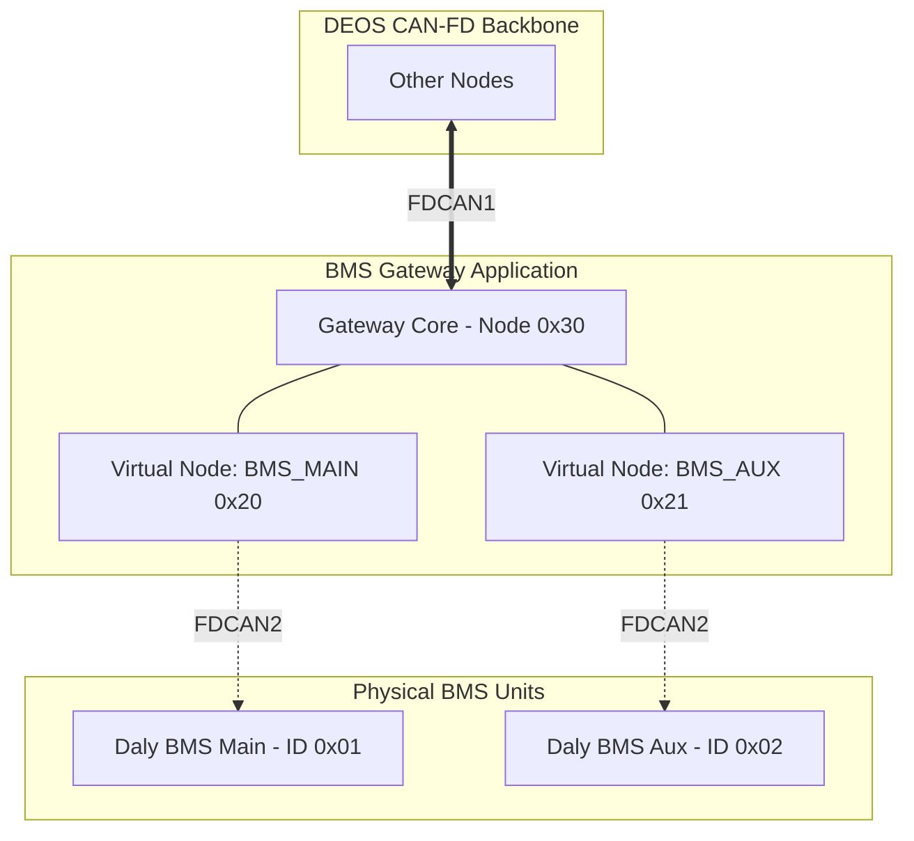

# DEOS BMS Gateway (Advanced Node & Protocol Proxy)

DEOS BMS Gateway, DEOS (CAN-FD) iletişim omurgası ile **Daly BMS** donanımları (Classic CAN) arasında çift yönlü iletişim sağlayan, otonom proxy ve protokol çeviricidir. 

Bu uygulamanın ana amacı, donanım düzeyinde kapalı bir protokol kullanan Daly BMS cihazlarını, DEOS omurgası üzerinde standart ve bağımsız birer DEOS Node'u gibi göstermektir. Sistem, her iki batarya donanımını (BMS Main ve BMS Aux) soyutlayarak omurgaya entegre eder.

---

## 🏗 Sistem Mimarisi

BMS Gateway, DEOS Core (omurga kütüphanesi) ile Daly BMS'ler (donanım katmanı) arasında asenkron bir köprü kurar.



### Virtual (Local) Node Mekanizması
Gateway, ağa fiziksel olarak tek bir CAN arayüzünden (`fdcan1`) bağlansa da, `deos_register_local_node()` API'sini kullanarak ağda **3 farklı Node** gibi davranır:
- **`0x30` DEOS_NODE_BMS_GATEWAY:** Kendi yönlendirme arayüzü ve iletişim hataları için.
- **`0x20` DEOS_NODE_BMS_MAIN:** Daly Board 1'in doğrudan DEOS'taki yansıması.
- **`0x21` DEOS_NODE_BMS_AUX:** Daly Board 2'nin doğrudan DEOS'taki yansıması.

---

## 🧵 Thread ve Cache Mimarisi

Gateway asenkron bir mimariyle çalışır ve DEOS ağ trafiğini boğmamak için **Cache (Önbellek) Mekanizması** kullanır. Cihaz içindeki akış 3 ana iş parçacığı (thread) ve 1 kesme (ISR) üzerinde yürütülür:

### 1. Daly Polling Thread (`polling_thread_id`)
BMS cihazları kendi kendilerine düzenli veri yollamazlar. Polling Thread, her iki cihaza da 100ms/200ms bekleme süreleriyle döngüsel olarak şu istekleri (`0x1800XXXX`) atar:
- `0x90`: Batarya Genel Durumu (Voltaj, Akım, SOC)
- `0x95`: Hücre Voltajları (Döngüsel frame index ile)
- `0x4D` & `0x4F`: Hücre Balancing Durumları
- `0x98`: Fiziksel Sensör ve Alarm Durumları

### 2. Daly RX ISR ve RX Thread (`gateway_thread_id`)
Classic CAN (`fdcan2`) üzerinden gelen paketler anında bir Message Queue (`daly_can_rx_queue`) içine aktarılır. `daly_rx_thread` bu kuyruğu okuyarak `DalyParser` sınıfı aracılığıyla bit seviyesinde verileri çözer ve Gateway'in dahili RAM önbelleğine (`DeosBmsStatus` struct) yazar.

### 3. DEOS MSG Handler (Cache Freshness)
Ağdaki bir cihaz (örneğin Dashboard veya VCU), `DEOS_NODE_BMS_MAIN` cihazından bilgi istediğinde, Gateway önce önbelleğin tazeliğini (`BMS_CACHE_FRESHNESS_MS`, varsayılan: 500ms) kontrol eder:
- Veri taze ise: Gateway, BMS'i hiç yormadan anında `DEOS_CLASS_RESPONSE` üretir.
- Veri bayat ise: Talebi beklemeye alır (Pending Request), Daly BMS'ten güncel veriyi çeker çekmez DEOS'a yollar.

---

## ⚡ Protokol Çeviri ve Veri Haritalama (Mapping)

Daly'den gelen tescilli 8-byte payload'lar, `ICD_BMS.tex` dökümanına tam uyumlu DEOS struct yapılarına dönüştürülür:

| Daly CAN ID | Daly Verisi | DEOS Komutu | Çeviri Mantığı |
|---|---|---|---|
| `0x90` | Pack Status | `DEOS_CMD_BMS_STATUS` | Voltaj, akım ve SOC 0.1 çarpanından DEOS standart çözünürlüğüne kaydırılır. |
| `0x95` | Cell Volts | `DEOS_CMD_BMS_CELL_VOLTAGE` | Her 3 hücrede bir gelen frame parse edilir, DEOS'a 1'den başlayan endekslerle tek tek 16 frame olarak basılır. |
| `0x4D/4F` | Balancing | `DEOS_CMD_BMS_BALANCING` | Bitmask yapısı çözümlenir, 16 bitlik maske taranıp hangi hücrenin aktif/pasif olduğu listelenir, liste 0x00 ile bitirilir. |
| `0x98` | Alarms | `DEOS_FAULT_RAISE` | Byte0 ve Byte1'deki bitler taranır, DEOS Fault API'sine yönlendirilir. |

---

## 🚨 Gelişmiş Fault (Hata) Yönetimi

BMS Gateway, hem donanımsal iletişim hatlarına hem de batarya paketlerinin güvenliğine dair tam teşekküllü bir **Fault Supervisor** görevi görür. Hatalar (Faults), oluştukları katmana göre farklı Node ID'ler ile fırlatılır.

### Gateway Spesifik Hatalar (Node: `0x30`)
Eğer Gateway, BMS'lerin birinden fiziksel olarak veri alamazsa (`BMS_TIMEOUT_MS` aşılırsa), doğrudan iletişim koptuğunu ilan eder:
- `DEOS_GW_FAULT_MAIN_COMM_LOST (0x0100)`: Ana batarya ile iletişim kesildi!
- `DEOS_GW_FAULT_AUX_COMM_LOST (0x0101)`: Yedek batarya ile iletişim kesildi!

### Batarya Sensör Hataları (Node: `0x20` / `0x21`)
Gateway, Daly `0x98` Alarm frame'ini çözdüğünde (Parse) fiziksel bir tehlike sezerse (Örn: Hücre voltajı çok yükselmişse), hatayı *Gateway olarak değil*, tehlikede olan *Batarya olarak* bildirir:
- `DEOS_BMS_FAULT_PACK_OVERVOLTAGE (0x0100)`
- `DEOS_BMS_FAULT_PACK_UNDERVOLTAGE (0x0101)`
- `DEOS_BMS_FAULT_CHARGE_OVERCURRENT (0x0102)`
- `DEOS_BMS_FAULT_DISCHARGE_OVERCURRENT (0x0103)`
- `DEOS_BMS_FAULT_OVERTEMPERATURE (0x0104)`
- `DEOS_BMS_FAULT_INTERNAL_ERROR (0x0107)`

Gateway iletişim veya tehlike durumu düzeldiğinde, otonom olarak `deos_fault_set_inactive()` komutunu göndererek hatayı temizler.

---

## 🔌 Donanım Konfigürasyonu (Pinmux)

Nucleo-H563ZI kartında cihaz ağaç (DeviceTree / `app.overlay`) ayarlamaları şu şekildedir:

1. **`fdcan1` (DEOS Network):** 
   - `PD0` (RX) / `PD1` (TX)
   - 1 Mbps / 5 Mbps (CAN-FD)
2. **`fdcan2` (Daly Classic CAN):**
   - `PB5` (RX) / `PB6` (TX)
   - 250 kbps (Classic CAN) - DALY BMS'nin fabrika ayarındaki baudrate'i ile eşleşmelidir.

> **Uyarı:** CAN-FD hatlarında 120 Ohm sonlandırma dirençleri (Termination resistor) bulunmalıdır. Özellikle PB5 ve PB6 pinlerine bağlayacağınız CAN Transceiver'in 3.3V mantık seviyesini desteklediğinden (veya level shifter kullanıldığından) emin olun.

---

## 🚀 Derleme ve Yükleme

Zephyr build sistemini kullanarak firmware'i derlemek için:

```bash
# Zephyr ortamını aktif edin
source ~/zephyrproject/.venv/bin/activate

# BMS Gateway uygulamasını H563ZI için derleyin
west build -p -b nucleo_h563zi apps/bms_gateway
```

PyOCD, STM32CubeProgrammer veya OpenOCD kullanarak cihaza yazın:
```bash
west flash
```

---

## 🛠 Sorun Giderme (Troubleshooting)

- **`[err] can_stm32fd: CAN pinctrl setup failed (-2)`:** 
  Bu hata, `app.overlay` dosyasında `fdcan2` için pin atamalarının (PB5/PB6) hatalı yapılandırıldığı veya Zephyr Pinctrl nodunun devre dışı olduğu durumlarda oluşur. DeviceTree pinmux ayarlarını kontrol edin.
- **Log'larda sürekli `BMS Board X Comm Lost` uyarısı:** 
  - BMS kapalı olabilir.
  - CAN_H ve CAN_L kabloları ters bağlanmış olabilir.
  - İki CAN hattı arasındaki baudrate (hız) eşleşmiyor olabilir.
  - Ortak GND (Toprak) bağlanmamış olabilir.
- **Tüm değerler 0 (sıfır) dönüyor:** 
  Daly BMS, uyku moduna (sleep mode) geçmiş olabilir. Daly BMS'i uyandırmak için UART veya BLE modülü tetiklenmeli veya sistem üzerinden bir wake-up paketi yollanmalıdır.
